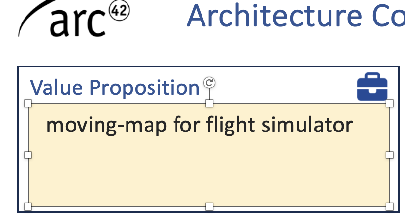
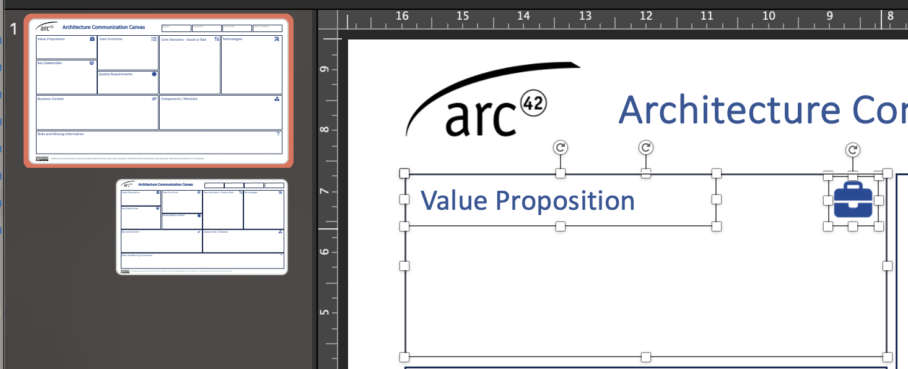

>This page is currently under (heavy) construction. We have collected quite a pile of questions and answers, and are currently busy getting these onto this website... stay tuned.

## Do you prefer Flat White or Cappuccino?
Ben and Patrick usually drink Flat White whenever possible.
Gernot prefers Cappuccino because it's not as strong (and allows him to drink more of it!).

## What is the relation of the canvas to arc42?

> Both AIC (architecture inception canvas) and ACC (architecture communication canvas) are perfectly compatible with the well-established arc42 template.

Either of these canvas types can be a starting point for more extensive or elaborate documentation of an architecture.
Additionally, the arc42 open source organization is maintaining, supporting and hosting these canvases.

## How to use the PowerPoint® version?

The pptx version of the canvas looks identical to other formats:

figure: pptx-version of the Architecture Communication Canvas

Using it is actually straightforward: Just click into the _yellowish_ rectangles and start typing, as shown below:

figure: typing in the pptx version

> The downloadable version has two slides - one with _yellowish_ rectangles to type in, and a second with these rectangles in white (which makes them invisible...)

All the rectangles, headers, icons are embedded into the slide master. In case you need to change these, you have to enter the "slide master" view, as shown next:

figure: (excerpt from) the slide-master

## How shall I create a canvas?

### With a group of people
We found the canvas to be a highly effective _collaboration_ tool, sparking mutual understanding in a group of people.

* Therefore, get together with some people that have a _stake_ in the system under consideration, some interest or motivation
* With your tool of choice (see below, we prefer a huge sheet of paper), start brainstorming the different sections of the canvas.

## How do the different canvas types relate to each other?

The [_Architecture Inception Canvas_](https://canvas.arc42.org/architecture-inception-canvas) provides an efficient and collaborative approach to defining your software architecture playground. It is an ideal tool for designing and conceptualising new systems from scratch, especially for new approaches to software development.

The [_Architecture Communication Canvas_](https://canvas.arc42.org/architecture-communication-canvas) is designed for communicating existing architectures. It is the "elevator pitch" of software architecture and provides the most compact way to explain and communicate your system. It helps communicate the key elements of existing software architectures.

Both canvases are fully compatible with the [arc42 template](https://arc42.org/overview).

## What tool(s) shall I use?

1. Try pen and paper first, electronic or digital tools later.
2. Try the most collaborative tool you have in your toolbox. We like tools like [Miro](https://miro.com), [ConceptBoard](https://conceptboard.com/), [Mural](https://www.mural.co/), [FigJam](https://www.figma.com/de/figjam/team-collaboration/) or [Jamboard](https://jamboard.google.com)

Focus on content, not on tooling!

## How do I integrate the canvas in my current arc42 document without doing it twice?

## In practice, how often does a canvas need updating?

As the software architecture evolves, the canvas should also be updated.

The Canvas is a technique to define and document the software architecture in an iterative and lean way.

For example, if there new core decisions or risks are elaborated, these can be recorded in a new version of the Canvas.

The [_Architecture Inception Canvas_](https://canvas.arc42.org/architecture-inception-canvas) and the [_Architecture Communication Canvas_](https://canvas.arc42.org/architecture-communication-canvas) have a date/iteration field in the upper right corner. It is therefore intended for continuous, collaborative software architecture work.

## Is it useful to have multiple ACCs for really complex systems, for each subsystem and on each level?
(per team and the more overarching architecture?)

## How can I make relations/links between multiple canvases?

## What tends to be the hardest section to write on the Architecture Communication Canvas?

## Can I use the ACC to start a project, before I write an arc42 document?

If you're initiating a new software system, the [Architecture Inception Canvas](https://canvas.arc42.org/architecture-inception-canvas) is an ideal starting point for collaborating on defining your software architecture playground. It focuses heavily on the goals of a new software initiative. From this foundation, you can derive architectural hypotheses and identify technical challenges. With the results from these collaborative and iterative sessions, you can contribute the findings to the arc42 document. The Architecture Inception Canvas is fully compatible with the [arc42 template](https://arc42.org/overview).

## Should we revisit the canvas at the end of a delivery due to implementation-time changes?
(business or technological changes)

## How do we fill the section with good and bad decisions? When we make a decision, we do not know if it will turn out good or bad.

## Can we use the ACC to document key components of larger systems?

## How do your canvas and arc42 contradict or extend other models like TOGAF and Archimate?

## Do you have ideas for how the canvas documents should be organised, to allow for a better discoverability?

## Is there an automatic way to check if the doc is correct or outdated?

